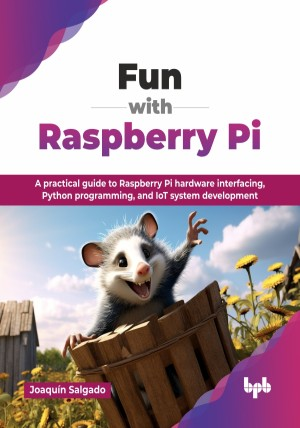

# Fun with Raspberry Pi

A practical guide to Raspberry Pi hardware interfacing, Python programming, and IoT system development.

This is the repository for [Fun with Raspberry Pi
](https://bpbonline.com/products/fun-with-raspberry-pi?variant=44525198803144),published by BPB Publications.

## About the Book
Raspberry Pi empowers makers and learners to build innovative projects, from simple electronics to complex IoT systems. It is powerful and adaptable enough to be used in almost any project scenario or problem to be solved. This book serves as your practical guide, transforming you from a beginner to a confident Raspberry Pi developer by leading you through hands-on projects and essential coding skills. 

Starting with the core components and GPIO connections of Raspberry Pi, you will learn to interface with hardware using both visual Scratch programming and Python. You will progress to integrating multimedia components like cameras and microphones, building projects like a video doorbell. The book then guides you through motor control and robotics, creating a smart car with sensor integration and remote control. You will explore Arduino integration for advanced sensor applications, construct a basic robot, and dive into IoT by building smart home systems. Finally, you will tackle a comprehensive project, applying all learned concepts to create a complex, integrated system.

By the end of this book, you will possess the practical skills and knowledge to confidently design, build, and deploy a wide range of Raspberry Pi projects, making you a competent creator in the world of embedded systems and IoT. 

## What You Will Learn
• Raspberry Pi GPIO, HATs, Arduino integration, and basic IoT device connectivity.

• Scratch and Python for hardware interfacing, GPIO control, and library utilization.

• Camera and audio integration, image/video processing, and recording/playback systems.

• Motor control, robotics, remote car operation, and sensor-driven speed regulation.

• Sense HAT sensor data acquisition and LED matrix display programming techniques.

• Arduino and Raspberry Pi hybrid project design for sensor-based automated systems.

• Robot construction: integrating motors, sensors, cameras, and control logic.

• IoT device setup, remote access, and control via internet protocols on Raspberry Pi.

• Smart home system architecture, local/remote sensor readings, and control mechanisms.

• Complex, multi-device project design, integration, and implementation methodologies.
